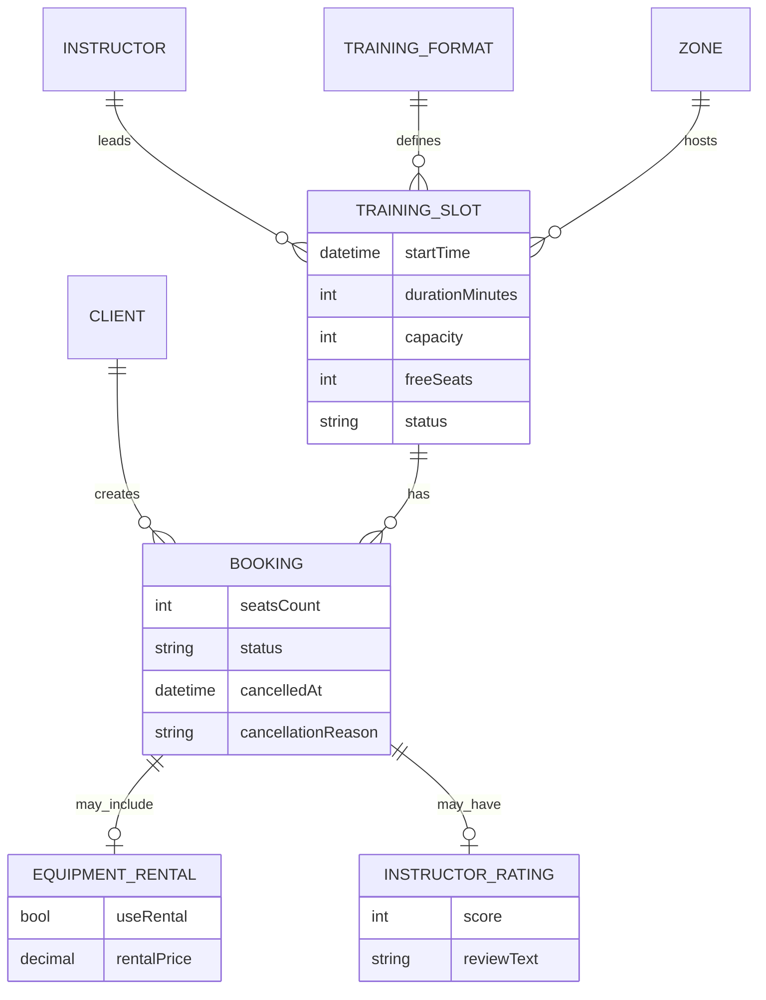

# Описание домена — скалодром «Вертикаль»

> **Источник:** [brief-climbing.md](../brief-climbing.md)  
> **Этап:** выявление требований (`1-elicitation/`)  
> **Статус:** согласовано с заказчиком — [answers.md](./answers.md)

---

## 1. Контекст

**Скалодром «Вертикаль»** — индор-скалодром в бывшем складском ангаре. Третий год проводит групповые тренировки.

**Проблема:** запись ведётся вручную через Telegram и бумажную тетрадь. В часы пик возникают двойные брони, путаница с инструкторами и занятостью групп.

**Цель:** клиенты самостоятельно записываются на тренировки через мобильное приложение; владелец контролирует процесс через существующую инфраструктуру.

**Дедлайн:** начало осени (новый сезон).

---

## 2. Участники (акторы)

| Актор | Описание | В текущей поставке |
|-------|----------|-------------------|
| **Клиент** | Совершеннолетний пользователь (18+); регистрация email + пароль; записывается на групповые тренировки, выбирает прокат, отменяет запись, получает push | ✅ Основной пользователь |
| **Инструктор** | Ведёт групповую тренировку (~1,5 ч), назначается на слот | ❌ Интерфейс уже есть в инфраструктуре |
| **Владелец / администратор** | Формирует расписание, управляет отменами и профилактикой | ❌ Админка уже есть в инфраструктуре |
| **Бэкенд скалодрома** | Источник истины: слоты, места, инструкторы, атомарное бронирование | Black-box для клиентского приложения |

---

## 3. Ключевые понятия (глоссарий)

| Термин | Определение |
|--------|-------------|
| **Слот (Training Slot)** | Единица расписания: время начала, длительность (~90 мин), зона, формат, инструктор (фиксированы вместе), ёмкость, свободные места, статус |
| **Формат тренировки** | Тип занятия: болдеринг с инструктажем (новички) или трассы с верёвкой (опытные) |
| **Зона** | Физическая область скалодрома; **новичковая зона** определяет тренировку с лимитом 8 мест |
| **Бронирование (Booking)** | Запись клиента на слот; может включать несколько мест (гости) |
| **Прокат** | Полный комплект снаряжения (скальники, страховочная система, каска, магнезия) — целиком или своё; частичный прокат не поддерживается |
| **Постоянный клиент** | Программа лояльности: скидка, бейдж, приоритет записи + внутренняя отметка (вне MVP) |
| **No-show** | Клиент не пришёл; отдельного сценария нет — приравнивается к поздней отмене (после 24 ч) |

---

## 4. Сущности домена

### 4.1. Клиент

- Регистрация: **email + пароль**
- Только **совершеннолетние** (18+)
- Профиль (уровень, размер обуви, мед. ограничения) — **не нужен**
- При первой записи — принятие **правил безопасности / оферты**

### 4.2. Слот тренировки

- Клиент выбирает **готовый слот**: время + формат + инструктор связаны, отдельно инструктора не выбирают
- Ёмкость: до **16** человек; в **новичковой зоне** — до **8** (автоматически)
- Фильтры при просмотре: формат, инструктор, время суток, «только со свободными местами»
- По умолчанию — слоты на **7 дней** (R-027); расширение через фильтр дат

### 4.3. Бронирование

- Можно указать **количество мест** (запись с друзьями)
- Несколько **активных записей** одновременно — разрешено
- Допуск к форматам: опытный → на новичковую **можно**; новичок → на опытную **нельзя**
- Статусы:
  - **Активна**
  - **Отменена клиентом** (не позднее чем за 24 ч)
  - **Отменена скалодромом** + причина (R-008)
  - **Завершена** (для оценки инструктора — post-MVP)

### 4.4. Прокат снаряжения

- Комплект целиком: скальники, страховка, каска, магнезия — или **всё своё**
- Частичный прокат — **не поддерживается**
- Цена проката — **отдельной строкой**; итоговая сумма показывается до подтверждения
- Если прокатного фонда не хватает — **предупреждение**; при подтверждении клиентом запись проходит (ответственность на клиенте)

### 4.5. Оценка инструктора (post-MVP)

- Шкала **1–5** + **текстовый отзыв**
- Окно: **24 часа** после тренировки
- После отправки — **изменить нельзя**
- Средний рейтинг клиентам **не показывается** (только аналитика владельца)

---

## 5. Бизнес-процессы

### 5.1. Регистрация и onboarding

1. Клиент регистрируется (email + пароль)
2. При первой записи принимает правила безопасности
3. В приложении доступен документ с правилами посещения (адрес, режим, что взять)

### 5.2. Просмотр расписания

1. Клиент видит слоты на 7 дней с фильтрами
2. Если слотов нет — empty state: «Пока нет доступных тренировок»

### 5.3. Бронирование

1. Выбор слота → количество мест → своё/прокат снаряжения
2. Показ правил отмены + итоговой стоимости (тренировка + прокат отдельной строкой)
3. Подтверждение → бэкенд атомарно проверяет места (R-004)
4. При конфликте — сообщение «место уже занято» (без очереди и автоподбора слота)

### 5.4. Отмена клиентом

1. Бесплатная отмена — **не позднее чем за 24 часа** до начала
2. **Менее чем за 24 часа** — отменить **нельзя** (кнопка недоступна)
3. No-show — отдельного статуса нет; правило то же (отмена после 24 ч невозможна)

### 5.5. Отмена скалодромом

1. Администратор отменяет слот в существующей инфраструктуре
2. Бронь → статус «Отменена скалодромом» + причина (любая со стороны исполнителя)
3. Push-уведомление с извинениями (R-008)
4. Переносов **нет** — только отмена; повторная запись на тот же слот запрещена

### 5.6. Уведомления (MVP)

| Событие | Push |
|---------|------|
| Напоминание о тренировке | ✅ (время — **настраиваемое**) |
| Отмена (клиентом / скалодромом) | ✅ |
| Подтверждение записи | ❌ |
| «Осталось мало мест» | ❌ |
| Смена инструктора | ❌ |

Канал: **только push** (без SMS/email/Telegram).

### 5.7. Оценка инструктора (post-MVP)

1. В течение 24 ч после тренировки — оценка 1–5 + текст
2. Данные доступны только владельцу

---

## 6. Бизнес-правила

| ID | Правило | Источник |
|----|---------|----------|
| BR-001 | Групповые тренировки длятся ~1,5 часа | Бриф |
| BR-002 | Максимум 16 человек в группе | Бриф |
| BR-003 | В новичковой зоне — не более 8 человек | Бриф + ответы |
| BR-004 | Расписание формируется на неделю вперёд | Бриф |
| BR-005 | Клиенту по умолчанию показываются слоты на 7 дней | R-027 |
| BR-006 | Двойные брони исключены — гарантия на стороне бэкенда | R-004 |
| BR-007 | При отмене скалодромом бронь сохраняется со статусом и причиной | R-008 |
| BR-008 | Повторная запись на отменённый слот запрещена | R-008 |
| BR-009 | Отмена клиентом возможна только за ≥24 ч до начала; позже — нельзя | Ответы |
| BR-010 | Клиентское приложение не создаёт и не редактирует слоты | Скоуп |
| BR-011 | Регистрация: email + пароль; только 18+ | Ответы |
| BR-012 | Один бронирование может включать несколько мест | Ответы |
| BR-013 | Опытный может записаться на новичковую; обратно — нет | Ответы |
| BR-014 | Прокат — только полный комплект или всё своё | Ответы |
| BR-015 | При нехватке проката — предупреждение, запись по подтверждению клиента | Ответы |
| BR-016 | Правила отмены показываются до подтверждения записи | Ответы |
| BR-017 | Перенос слотов не поддерживается — только отмена | Ответы |
| BR-018 | No-show не выделяется отдельно от поздней отмены | Ответы |
| BR-019 | Оплата в MVP — на месте; в приложении только информирование о стоимости | Ответы |
| BR-020 | Будущая онлайн-оплата — при записи; возврат при отмене в срок | Ответы |

---

## 7. MVP vs post-MVP

| Функция | MVP (начало осени) | Post-MVP |
|---------|-------------------|----------|
| Регистрация (email + пароль) | ✅ | |
| Просмотр слотов + фильтры | ✅ | |
| Бронирование (несколько мест) | ✅ | |
| Прокат (полный комплект) | ✅ | |
| Отмена клиентом (правило 24 ч) | ✅ | |
| Push: напоминание + отмена | ✅ | |
| Правила безопасности / оферта | ✅ | |
| Информирование о стоимости | ✅ | |
| iOS + Android | ✅ | |
| Оценка инструкторов (1–5 + текст) | | ✅ |
| Экран «Мои записи» / история | | ✅ |
| Программа лояльности (скидка, бейдж, приоритет) | | ✅ |
| Онлайн-оплата | | ✅ (при записи) |

> **⚠️ Противоречие в ответах:** Q9.2 («в MVP — уведомления, прокат») vs Q9.5 («фильтры — да»). В таблице фильтры включены в MVP как базовый UX расписания. Уточните у заказчика, если нужна жёсткая приоритизация.

---

## 8. Pain points (проблемы домена)

| Проблема | Последствие | Как решает система |
|----------|-------------|-------------------|
| Ручная запись в Telegram/тетрадке | Двойные брони, путаница | Самообслуживаемая запись + атомарность бэкенда |
| Нет visibility по свободным местам | Клиенты ждут ответа | Каталог слотов с фильтрами и числом мест |
| Поздние отмены | Простаивающие места | Отмена только за ≥24 ч + напоминания |
| Нет обратной связи по инструкторам | Сложно оценить качество | Рейтинг post-MVP |
| Профилактика зон | Клиенты не знают об отмене | Статус + push с извинениями |

---

## 9. Границы системы (scope)

### В скоупе текущей поставки

- Клиентское **мобильное приложение** iOS + Android (роль «Клиент», R-028)
- **API** для клиентского приложения
- MVP-сценарии: регистрация, слоты с фильтрами, бронирование, прокат, отмена, push, правила

### Вне скоупа

- Интерфейсы инструктора и администратора
- Создание и редактирование расписания
- Рейтинги, история записей, лояльность, онлайн-оплата (post-MVP)
- Транзакционность и внутренние модели бэкенда (R-004)

---

## 10. Связанные артефакты

| Артефакт | Описание |
|----------|----------|
| [brief-climbing.md](../brief-climbing.md) | Исходное письмо заказчика + уточнения по скоупу |
| [questions.md](./questions.md) | Уточняющие вопросы для заказчика |
| [answers.md](./answers.md) | Ответы заказчика |
