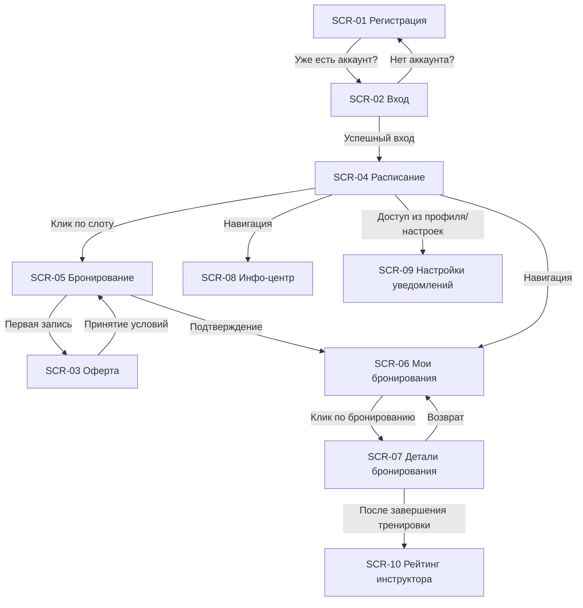

# Карта навигации приложения «Вертикаль»

Данная карта описывает переходы между экранами приложения на основе проектной документации.

## Схема переходов

### Описание переходов
1. **Авторизация и Регистрация**
    - [`SCR-01-registration.md`](3-design-brief/SCR-01-registration.md) $\rightarrow$ [`SCR-02-login.md`](3-design-brief/SCR-02-login.md) (Ссылка «Уже есть аккаунт? Войти»)
    - [`SCR-02-login.md`](3-design-brief/SCR-02-login.md) $\rightarrow$ [`SCR-01-registration.md`](3-design-brief/SCR-01-registration.md) (Ссылка «Нет аккаунта? Зарегистрироваться»)
    - [`SCR-02-login.md`](3-design-brief/SCR-02-login.md) $\rightarrow$ [`SCR-04-schedule.md`](3-design-brief/SCR-04-schedule.md) (После успешного входа)

2. **Основной пользовательский путь (Бронирование)**
    - [`SCR-04-schedule.md`](3-design-brief/SCR-04-schedule.md) $\rightarrow$ [`SCR-05-booking.md`](3-design-brief/SCR-05-booking.md) (Клик по карточке слота)
    - [`SCR-05-booking.md`](3-design-brief/SCR-05-booking.md) $\rightarrow$ [`SCR-03-offer.md`](3-design-brief/SCR-03-offer.md) (Если первая запись $\rightarrow$ Принятие оферты)
    - [`SCR-03-offer.md`](3-design-brief/SCR-03-offer.md) $\rightarrow$ [`SCR-05-booking.md`](3-design-brief/SCR-05-booking.md) (После принятия условий $\rightarrow$ Возврат к подтверждению)
    - [`SCR-05-booking.md`](3-design-brief/SCR-05-booking.md) $\rightarrow$ [`SCR-06-my-bookings.md`](3-design-brief/SCR-06-my-bookings.md) (После успешного подтверждения записи)

3. **Управление записями и Информация**
    - [`SCR-04-schedule.md`](3-design-brief/SCR-04-schedule.md) $\rightarrow$ [`SCR-06-my-bookings.md`](3-design-brief/SCR-06-my-bookings.md) (Навигация в «Мои бронирования»)
    - [`SCR-04-schedule.md`](3-design-brief/SCR-04-schedule.md) $\rightarrow$ [`SCR-08-info-center.md`](3-design-brief/SCR-08-info-center.md) (Навигация в «Инфо-центр»)
    - [`SCR-06-my-bookings.md`](3-design-brief/SCR-06-my-bookings.md) $\rightarrow$ [`SCR-07-booking-details.md`](3-design-brief/SCR-07-booking-details.md) (Клик по карточке бронирования)
    - [`SCR-07-booking-details.md`](3-design-brief/SCR-07-booking-details.md) $\rightarrow$ [`SCR-06-my-bookings.md`](3-design-brief/SCR-06-my-bookings.md) (Возврат к списку)

4. **Дополнительные экраны**
    - [`SCR-04-schedule.md`](3-design-brief/SCR-04-schedule.md) $\rightarrow$ [`SCR-09-notification-settings.md`](3-design-brief/SCR-09-notification-settings.md) (Навигация в «Профиль/Настройки»)
    - [`SCR-07-booking-details.md`](3-design-brief/SCR-07-booking-details.md) $\rightarrow$ [`SCR-10-instructor-rating.md`](3-design-brief/SCR-10-instructor-rating.md) (Доступен после завершения тренировки)

---

## Легенда
- $\rightarrow$ : Направление перехода
- `SCR-XX` : Идентификатор экрана