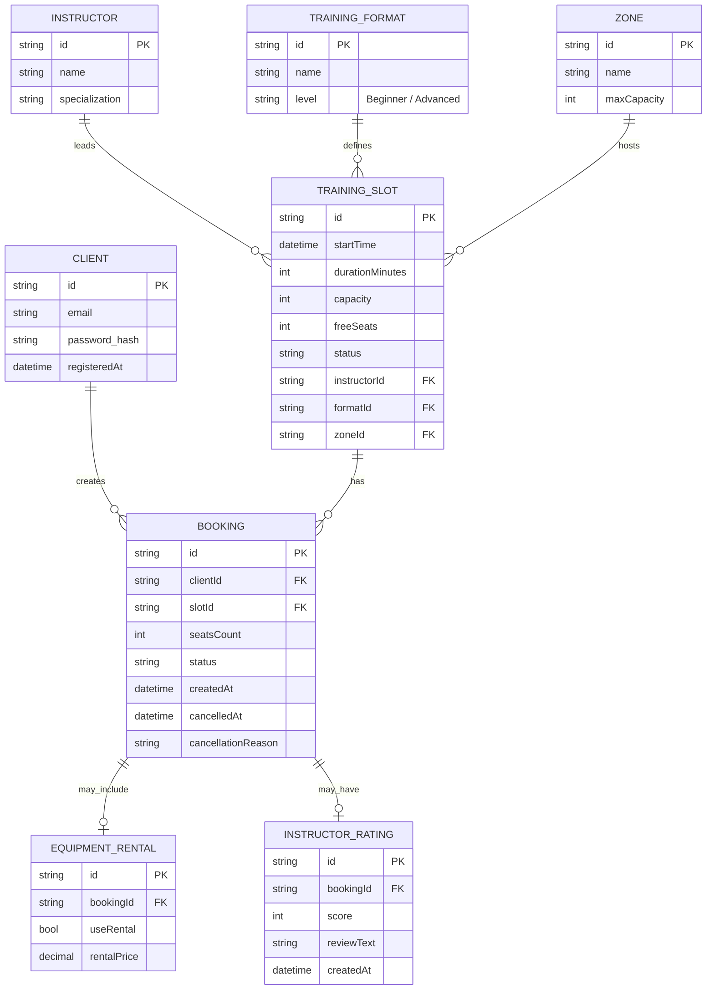
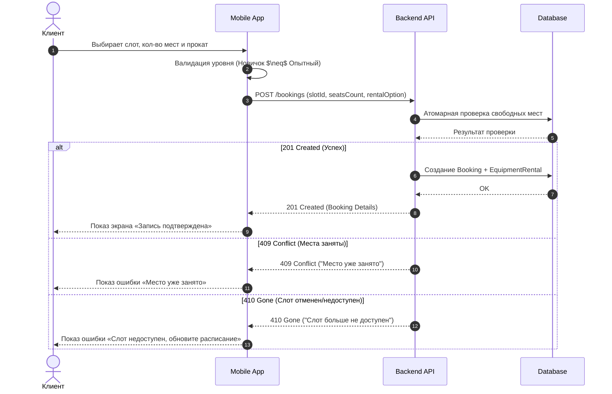

# ER-модель и модели сущностей системы «Вертикаль»

## 1. ER-модель (Entity-Relationship)

Модель описывает структуру данных для управления бронированием тренировок на скалодроме.

### Диаграмма связей (Mermaid)

---

## 2. Описание моделей сущностей и права доступа

В данной таблице указано, какие сущности приложение только читает (Read-only), а какие может изменять/создавать (Read-Write).

| Сущность | Тип доступа | Описание | Поля |
| :--- | :--- | :--- | :--- |
| **Client** | **Read-Write** | Профиль пользователя. Создается при регистрации, читается при авторизации. | `id`, `email`, `password_hash` |
| **TrainingSlot** | **Read-only** | Расписание. Формируется администратором в бэкенде. Приложение только отображает список и фильтрует. | `id`, `startTime`, `durationMinutes`, `capacity`, `freeSeats`, `status`, `instructorId`, `formatId`, `zoneId` |
| **Booking** | **Read-Write** | Запись на тренировку. Создается клиентом, читается в «Моих записях», обновляется при отмене. | `id`, `clientId`, `slotId`, `seatsCount`, `status`, `createdAt`, `cancelledAt`, `cancellationReason` |
| **EquipmentRental** | **Read-Write** | Информация о прокате. Создается вместе с бронированием. | `id`, `bookingId`, `useRental`, `rentalPrice` |
| **Instructor** | **Read-only** | Данные об инструкторе. Приходят из бэкенда для отображения в слоте. | `id`, `name`, `specialization` |
| **TrainingFormat** | **Read-only** | Типы тренировок (Болдеринг/Трассы). Справочник из бэкенда. | `id`, `name`, `level` |
| **Zone** | **Read-only** | Зоны скалодрома. Справочник из бэкенда. | `id`, `name`, `maxCapacity` |
| **InstructorRating** | **Read-Write** | Оценка инструктора. Создается клиентом после тренировки. | `id`, `bookingId`, `score`, `reviewText`, `createdAt` |

---

## 3. Sequence-диаграмма: createBooking

Сценарий создания бронирования с обработкой различных ответов бэкенда.

