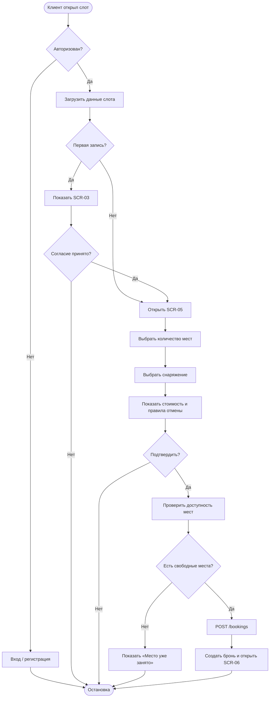

# LOGIC-01 Core booking flow

**ID:** LOGIC-01  
**Тип:** Логика  
**Домен:** 09. Логики  
**Приоритет:** Critical  
**Статус:** Черновик  
**Функциональные блоки:** FB-BOOK-001, FB-BOOK-002, FB-BOOK-003

---

## Обзор

Данная логика описывает основной сценарий бронирования тренировки: выбор слота, проверка условий, оформление брони, обработка конфликтов и переход в список броней.

### User Story

> Как клиент, я хочу успешно забронировать тренировку, чтобы быть зачисленным в группу без ручной переписки.

### Бизнес-ценность

- обеспечивает корректное оформление записи;
- исключает двойные брони и ручные ошибки;
- даёт понятный результат пользователю в случае конфликта.

---

## Точки применения

| Экран/Компонент | Элемент/Триггер | Условие |
|---|---|---|
| SCR-04 Расписание | Тап по карточке слота | Всегда |
| SCR-05 Бронирование | Подтверждение записи | Всегда |
| SCR-03 Оферта | Продолжение после согласия | При первой записи |

---

## Флоу

---

## Описание логики

### Шаг 1: Подготовка к бронированию

Система проверяет, авторизован ли клиент. Если нет, он направляется на экран входа или регистрации. Если авторизован — загружаются данные выбранного слота.

### Шаг 2: Проверка согласия с правилами

Для клиента, который ещё не принимал правила безопасности, перед бронированием показывается экран согласия. Только после подтверждения пользователь может продолжить оформление.

### Шаг 3: Сбор параметров записи

Пользователь выбирает количество мест и вариант снаряжения. На основе этого рассчитывается стоимость тренировки и проката, а также показываются правила отмены.

### Шаг 4: Подтверждение и создание брони

При подтверждении клиентом записи backend атомарно проверяет наличие свободных мест. Если места есть — создаётся бронь. Если нет — операция завершается ошибкой с сообщением о конфликте.

---

## API запросы

### POST /bookings

**Триггер:** Нажатие кнопки подтверждения на SCR-05.

**Параметры/Body:**

| Параметр | Тип | Описание |
|---|---|---|
| slotId | string | ID выбранного слота |
| seatsCount | integer | Количество мест |
| rentalOption | string | own / rental |

**Обработка ответа:**

- success → перейти в список броней;
- 409 → показать сообщение «Место уже занято»;
- 410 → показать «Слот отменён или больше недоступен».

---

## Связанные требования

### Функциональные

| ID | Название | Приоритет |
|---|---|---|
| FR-003 | Принятие правил безопасности | Must |
| FR-010 | Выбор количества мест | Must |
| FR-014 | Выбор снаряжения | Must |
| FR-017 | Итоговая сумма | Must |
| FR-020 | Атомарная проверка мест | Must |
| FR-021 | Сообщение о конфликте | Must |

---

## Критерии приёмки

| ID | Критерий |
|---|---|
| AC-001 | Дано: клиент авторизован и выбрал слот, Когда он нажимает «Подтвердить запись», Тогда бронь создаётся только если есть свободные места. |
| AC-002 | Дано: клиент впервые оформляет бронь, Когда он проходит через экран оферты, Тогда продолжение возможно только после согласия. |
| AC-003 | Дано: место уже занято, Когда запрос на создание брони завершается конфликтом, Тогда пользователь получает понятное сообщение и бронь не создаётся. |

---

## Обработка ошибок

| Тип ошибки | Контекст | Действие |
|---|---|---|
| 409 Conflict | Нет свободных мест | Показать сообщение «Место уже занято» |
| 410 Gone | Слот отменён | Показать сообщение «Слот больше недоступен» |
| Ошибка сети | Нет соединения | Показать «Проверьте подключение» |
