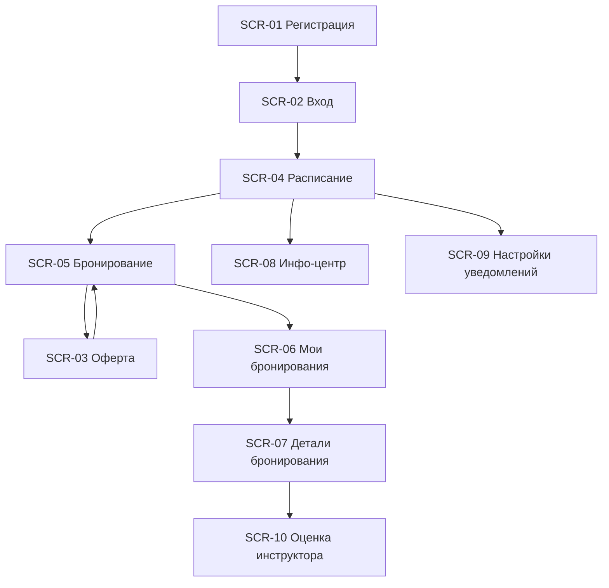

# Техническая спецификация мобильного приложения «Вертикаль»

**ID:** APP-VERTICAL-01  
**Тип:** Пакет технических спецификаций  
**Статус:** Черновик  
**Версия:** 0.1  
**Цель:** Описать клиентское мобильное приложение для самостоятельной записи клиента на групповые тренировки в скалодроме «Вертикаль».

---

## 1. Область применения

Данный пакет описывает MVP клиентского приложения для роли «Клиент». В рамках поставки реализуются:

- регистрация и вход;
- просмотр расписания тренировок;
- выбор слота и оформление бронирования;
- просмотр и отмена собственных броней;
- просмотр правил посещения;
- настройка push-напоминаний;
- (post-MVP) оценка инструктора.

Вне области текущей поставки:

- создание и редактирование слотов расписания;
- интерфейсы инструктора и администратора;
- онлайн-оплата.

---

## 2. Бизнес-цель и ограничения

Основная цель приложения — снизить нагрузку на персонал и исключить ошибки ручной записи, связанные с двойными бронями и конфликтами по свободным местам.

Ключевые ограничения:

- приложение использует существующий backend как «чёрный ящик»;
- все данные о расписании, инструкторах и слотах приходят через API;
- гарантия отсутствия двойных броней обеспечивается на стороне бэкенда;
- для MVP оплата не онлайн, а на месте.

---

## 3. Пользовательские сценарии

1. Регистрация и вход в приложение.
2. Поиск подходящей тренировки по дате, формату, инструктору и свободным местам.
3. Оформление бронирования с выбором количества мест и варианта снаряжения.
4. Просмотр списка активных и завершённых броней.
5. Отмена бронирования при соблюдении правила 24 часов.
6. Получение push-уведомлений и напоминаний.

---

## 4. Навигация приложения

---

## 5. Список документов спецификации

- [SCR-01-registration.md](SCR-01-registration.md) — регистрация клиента
- [SCR-02-login.md](SCR-02-login.md) — вход в приложение
- [SCR-03-offer.md](SCR-03-offer.md) — принятие оферты и правил безопасности
- [SCR-04-schedule.md](SCR-04-schedule.md) — экран расписания и фильтров
- [SCR-05-booking.md](SCR-05-booking.md) — оформление бронирования
- [SCR-06-my-bookings.md](SCR-06-my-bookings.md) — список броней
- [SCR-07-booking-details.md](SCR-07-booking-details.md) — детали бронирования
- [SCR-08-info-center.md](SCR-08-info-center.md) — инфо-центр и правила посещения
- [SCR-09-notification-settings.md](SCR-09-notification-settings.md) — настройки уведомлений
- [SCR-10-instructor-rating.md](SCR-10-instructor-rating.md) — оценка инструктора (post-MVP)
- [LOGIC-01-booking-flow.md](LOGIC-01-booking-flow.md) — логика core booking flow

---

## 6. Интеграции с API

| Сервис | Endpoint | Назначение |
|---|---|---|
| Auth | POST /auth/register | Регистрация клиента |
| Auth | POST /auth/login | Вход клиента |
| Info | GET /info/visiting-rules | Получение правил посещения |
| Slots | GET /slots | Получение списка слотов с фильтрами |
| Slots | GET /slots/{slotId} | Получение деталей слота |
| Bookings | GET /bookings | Получение списка броней клиента |
| Bookings | POST /bookings | Создание бронирования |
| Bookings | DELETE /bookings/{bookingId} | Отмена бронирования |
| Notifications | GET/PUT /me/notification-settings | Управление настройками уведомлений |
| Ratings | POST /ratings | Оценка инструктора (post-MVP) |

---

## 7. Общие требования к UX

- интерфейс должен быть быстрым и понятным для мобильного использования в зале;
- первичный сценарий — запись за 1–2 минуты;
- ошибки должны быть понятными и локализованными;
- загрузка и блокировка UI должны быть минимальными;
- состояние «нет данных» и «ошибка сети» должны быть явно показаны.

---

## 8. Критерии готовности MVP

- клиент может зарегистрироваться и войти;
- клиент видит расписание на 7 дней вперёд;
- клиент может забронировать слот с выбором количества мест и варианта снаряжения;
- клиент может отменить бронь до 24 часов;
- клиент получает push-уведомления о напоминании и отмене тренировки;
- клиент может открыть правила посещения и настроить уведомления.
